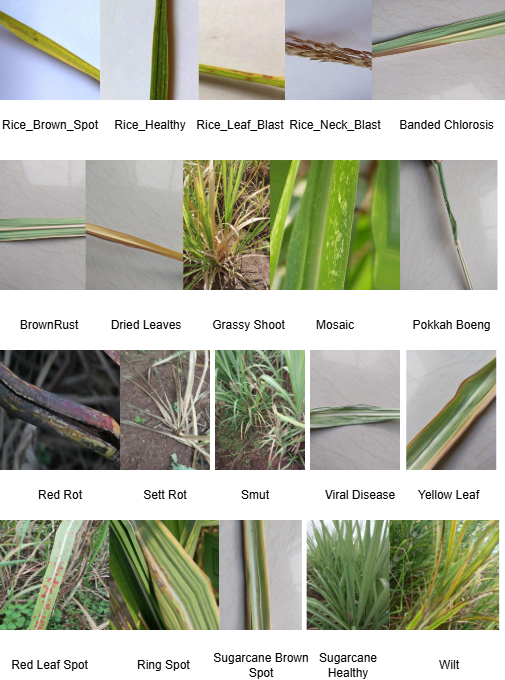

# S2RMCMD: Sugarcane and Rice Multi-Crop Multi-Disease Dataset & MDSA2CNet


## 📌 Overview
This repository contains the official implementation and dataset description for **S2RMCMD**, a comprehensive benchmark dataset for cross-crop disease classification, and **MDSA2CNet**, a hybrid deep learning framework designed for high-accuracy plant disease diagnosis.

S2RMCMD integrates three public sources—*Sugarcane1 Thite*, *Sugarcane2 (Assam)*, and *BangladeshiCrops Rice*—to provide a robust foundation for precision agriculture.

---

## 📊 Dataset: S2RMCMD




The **Sugarcane and Rice Multi-Crop Multi-Disease** dataset consists of **17,134 high-quality images** (as per study text) across **20 disease categories**.

### Data Distribution
| Crop | Disease Categories | Image Count |
| :--- | :--- | :--- |
| **Sugarcane** | Red Rot, Smut, Ring Spot, Grassy Shoot, Mosaic, etc. (16 classes) | 12,494 |
| **Rice** | Brown Spot, Healthy, Leaf Blast, Neck Blast (4 classes) | 4,617 |
| **Total** | **20 Classes** | **17,111** |

### Pre-processing Pipeline
To ensure reproducibility, all images undergo the following pipeline:
1. **Resizing:** $224 \times 224$ pixels (RGB).
2. **Illumination Correction:** Histogram equalization and per-channel normalization.
3. **Noise Reduction:** Morphological filtering to emphasize leaf regions.
4. **Augmentation:** Random flips, rotations ($\pm20^\circ$), scaling ($0.8-1.2x$), and color jittering (brightness, contrast, hue, saturation).

### S2RMCMD Dataset Link

https://data.mendeley.com/datasets/rt8sv9t445/4

---

## 🧠 Model: MDSA2CNet
**MDSA2CNet** is a hybrid architecture that leverages the efficiency of **MobileNetV2** and the depth of **DenseNet** variants, enhanced by a self-attention mechanism.

### Key Features:
* **Backbone Integration:** Concatenation of features from MobileNetV2, DenseNet121, DenseNet169, and DenseNet201.
* **Self-Attention:** Augmented feature-level attention to focus on critical disease lesions.
* **Transfer Learning:** Fine-tuned on the S2RMCMD dataset with hyperparameter optimization.

### Performance Metrics:
| Metric | Value |
| :--- | :--- |
| **Training Accuracy** | 98.38% |
| **Test Accuracy** | 95.29% |
| **Precision** | 95% |
| **Recall** | 94% |
| **F1-Score** | 95% |

---

## 🚀 Getting Started

### Installation
```bash
git clone https://github.com/anand1982/MDSA2CNet.git
pip install -r requirements.txt
